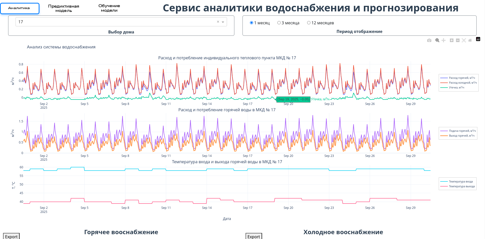
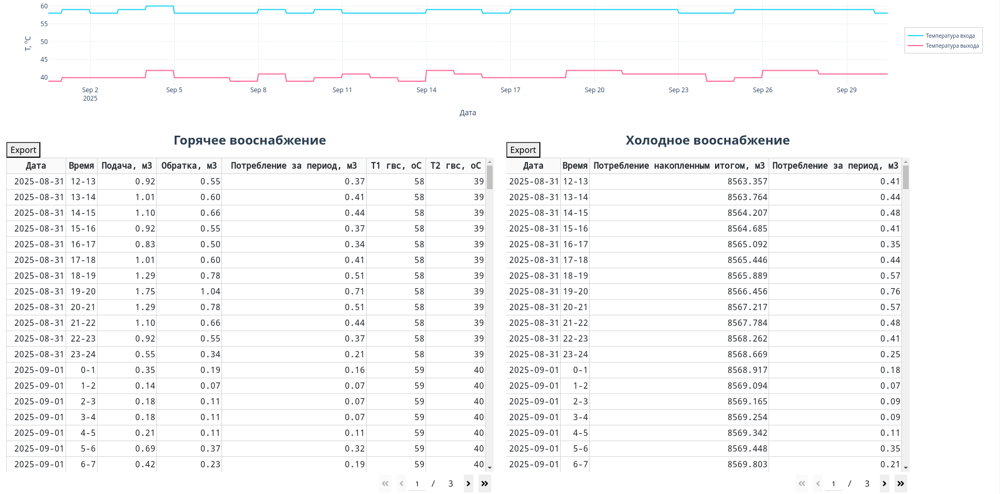
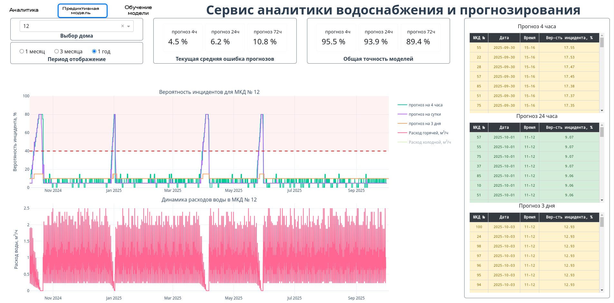

# Рекомендательный сервис прогнозирования возникновения технологических ситуаций

## Решаемая проблема 

Специалисты Центрального диспетчерского управления АО «Мосводоканал» ежедневно обрабатывают огромные массивы технологических данных в режиме реального времени. Отсутствие инструментов прогнозирования затрудняет заблаговременное реагирование на потенциальные нарушения в работе систем водоснабжения и водоотведения.

## Предлагаемое решение

Мы разработали `интеллектуальный рекомендательный сервис`, который использует машинное обучение для прогнозирования технологических ситуаций за 4, 24 и 72 часа до их возникновения. Это позволяет перейти от реактивного к `проактивному управлению` технологическими процессами.

## Ключевые преимущества:

🎯 `Точное прогнозирование` - три временных горизонта (4ч, 24ч, 72ч)

⚡ `Реальное время` - непрерывный мониторинг и анализ

📊 `Интуитивная визуализация` - понятные дашборды для диспетчеров

🔄 `Адаптивность` - система постоянно обучается на новых данных

🛡️ `Превентивность` - раннее предупреждение о потенциальных инцидентах

## Архитектура решения
Система построена на модульной архитектуре с использованием современных технологий:

### 1. Аналитический модуль реального времени
- Мониторинг ключевых показателей (расход воды, температура) по всем МКД

- Интерактивные графики и таблицы с историческими данными

- Экспорт отчетов в формате Excel для дальнейшего анализа

- Непрерывная интеграция с данными из АСУПР

### 2. Предиктивный модуль
- Ансамбль ML-моделей для многопериодного прогнозирования

- Визуальное сравнение прогнозов с фактическими данными

- Приоритизация объектов - автоматическое выделение МКД с высокой вероятностью инцидентов

- Мониторинг качества прогнозных моделей в реальном времени

### 3. Модуль машинного обучения

- Непрерывное дообучение моделей на новых данных

- Контроль и управление качеством прогнозирования

- Настройка сложности моделей для оптимизации точности/производительности

- Автоматическое развертывание обновленных моделей в продакшен

## Быстрый запуск прототипа на сервере:

!!! На сервере требуется наличие установленного `docker compose`

В командной строке переходим в директорию `prototype` и выполняем команду `docker-compose up -d`

ждем пока контейнеры поднимуться и можем переходить в браузере по адресу:

`http://[сетевой адрес сервера]:8124/`

и наслаждаться веб интерфейсом прототипа

### P.S. Живая демонстрация возможна по адресу `http://45.67.56.86:8124/` при недоступности по адресу попросить в телеграм `@kolyadavydov` поднять сервис 