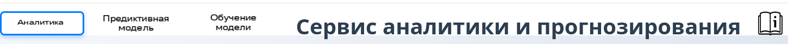
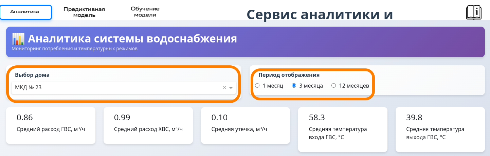
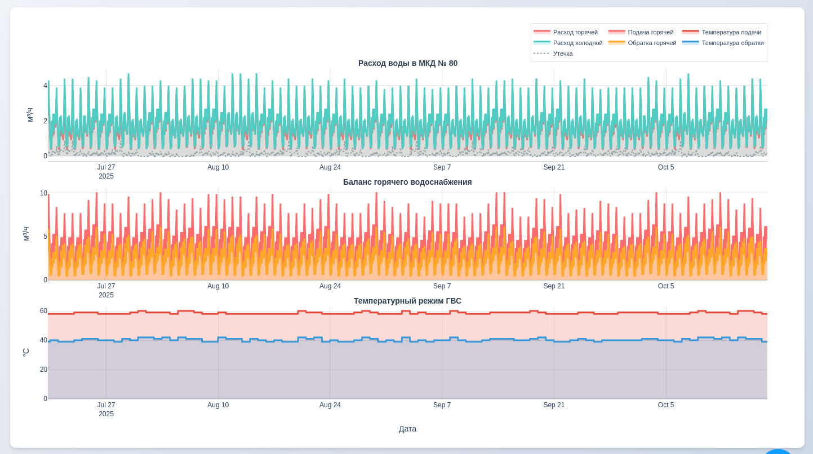
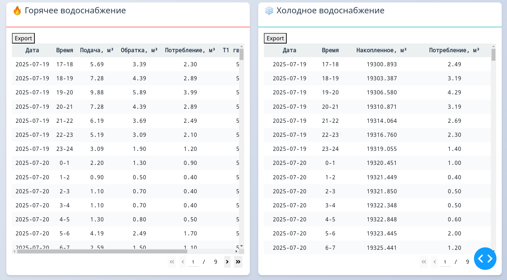
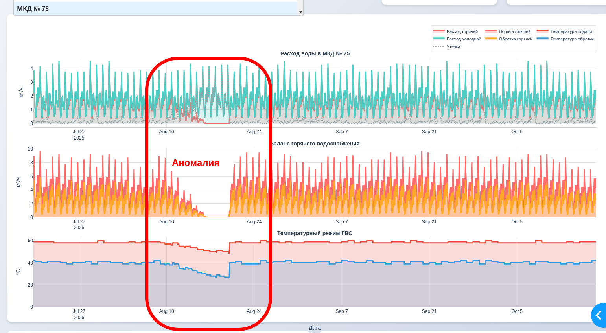
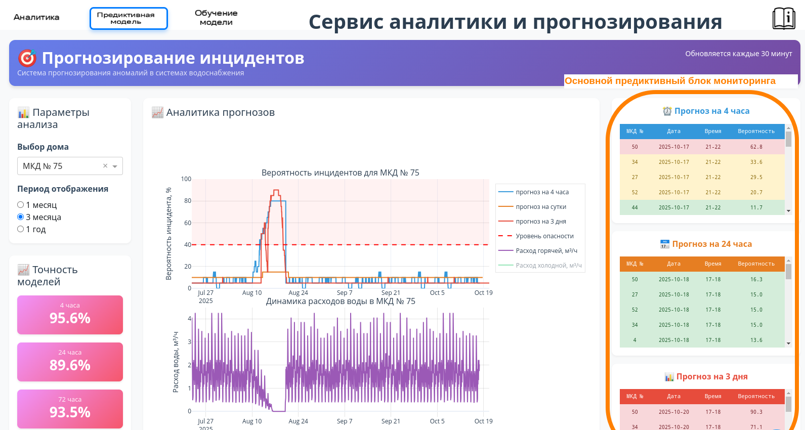
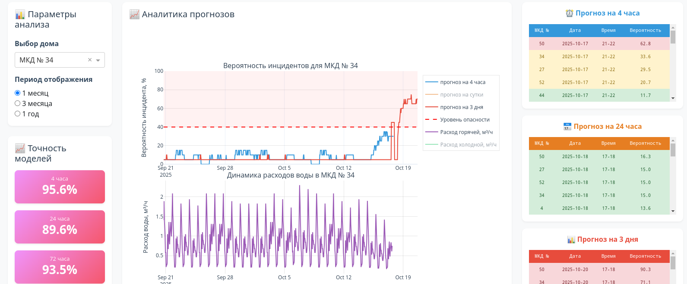
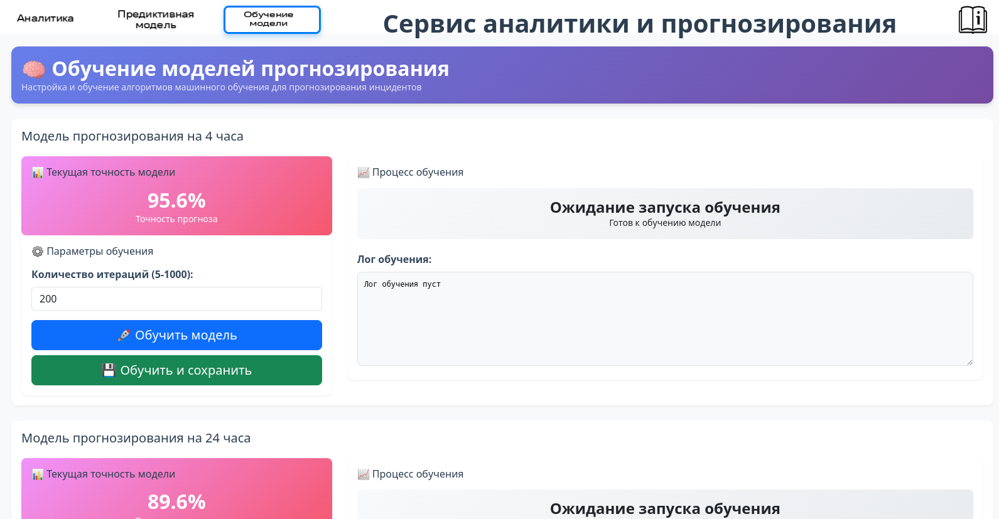

## 1. Введение

Специалисты Центрального диспетчерского управления АО «Мосводоканал» ежедневно обрабатывают огромные массивы технологических данных в режиме реального времени. Отсутствие инструментов прогнозирования затрудняет заблаговременное реагирование на потенциальные нарушения в работе систем водоснабжения и водоотведения.

**Сервис аналитики и прогнозирования** - предназначен для автоматической обработки данных счетчика учетов горячей и холодной воды в многоквартирных жилых домах. Сервис позволяет формировать графики расходов воды, осуществлять прогнозирование и предупреждение рисков.

Сервис в первую предназначен для диспетчеров с целью мониторинга ситуации и выявления предупреждений по все сети.

Сервис представляет собой много-пользовательский интерфейс включающий три основных блока.
- аналитический блок
- предиктивный блок
- блок для дообучения моделей машинного обучения

Переход между блоками осуществляется при нажатии соотвествующей кнопки:

## 2. Основные функции и как с ними работать

### Просмотр и выгрузка данных.
В аналитическом блоке имеется возможность просмтаривать данные мониторинга в режиме ***реального времени*** по каждому из отдельных домов.

Для этого выберети номер дома в ячейке `Выбор дома` и желаемый период отображения в ячейке `Период отображения` (доступно три периода: 1,3, 12 месяцев):

Ниже обновяться ячейки со сводной статистикой по выбранному дому.

После выбора номера дома и периода отображения ниже повится визуализация информация по расходам горячей и холодной воды, а так же температурные режимы горячего водоснабжения:

Для выгрузки данных по холожному  горячему водоснабжению необходимо нажать соответствующие кнопки `Export`:

## Выявление аномалий в исторических данных

В аналитическом блоке визуализация режимов водоснабжения позволяет выявлять аномалии:

## Предиктивный анализ

Основной предективный монторинг находится в предиктивном блоке.

В основном предиктивном блоке мониторинга отображается текущие прогнозы вероятности инцидента трех обученных моделей.

Так же пользователю предоставляется возможность отображени исторических данных по конкретному дому и прогнозы моделей о вероятности возникновения инцидента.

Например модели сигнализируют повышенный уровень опасности возникновения инцидента для дома 34:

## Дообучение моделей

Данный блок предназначен для дообучения моделей. Это может потребоваться если точность прогнозов с появлением новых данных начинает снижаться и при подключении новых домов к автоматической системе мониторнга.

Блок дообучения позволяет дообучать каждую из трех моделей отдельно, оценивать точность прогнозов и в случае повышения точности использовать дообученную модель в продуктовом контуре.

Для запуска обучения (без вывода в продуктовый контур необходимо нажать кнопку ***Обучить модель***).

После этого в графе *Лог обучения* появиться прогресс обучения с выводом точности прогнозов.

Если точность прогнозов устраивает, то можно нажать кнопку ***Обучить и сохранить***, после чего модель обучиться и будет использоваться в продуктовом контуре.

